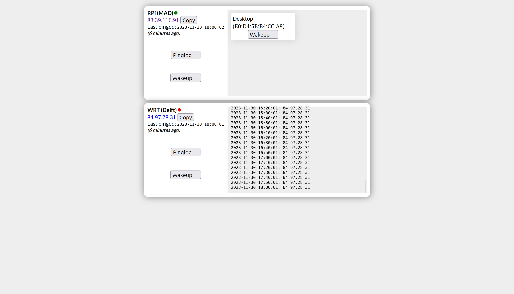

# Carmesyes
### Simple IoT device management back-end.
  
 ---
Main features:
1. IP logger + status indicator
2. Sending "wake-up" calls, or any arbitrary request
1. HTML redirection

Usage:
1. Ships ready to use (no compilation needed!)
2. Can be started with `docker compose up --build web`
3. Tested with `php:8.0` and `MySQL:8.0`

> IONOS compatible as of Nov/2023

 
